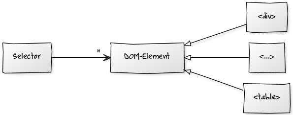

!SLIDE smaller
# [ Assumption: You know [HTML](http://en.wikipedia.org/wiki/Html) ]
# <http://de.selfhtml.org/>

!SLIDE code smallest
	@@@ html
	<!DOCTYPE html PUBLIC "-//W3C//DTD HTML 4.01 Transitional//EN" 
		"http://www.w3.org/TR/html4/loose.dtd">
	<html>
	<head>
	<meta http-equiv="Content-Type" content="text/html; charset=UTF-8">
	<title>My Notes</title>
	</head>
	<body>
	
	</body>
	</html>

!SLIDE
!SLIDE bullets incremental smaller
# Cascading StyleSheets (CSS)

* Extension to HTML
* Separate content from presentation by
* applying layout and formatting properties to DOM Elements
* CSS decides **how** HTML (**what**) will be displayed 

!SLIDE bullets
# Upcoming: CSS3
* Flexbox-Model <http://dev.w3.org/csswg/css3-flexbox/>
* gradients, rounded borders etc. (see <http://css3generator.com/>)

!SLIDE bullets
* Current Specification: 
* [CSS Level 2 Revision 1](http://www.w3.org/TR/CSS21/) (CSS 2.1)

!SLIDE
# How does it work?
 
!SLIDE code center
	@@@ css
	selector { attribute: value; }

 
 

<!--Edit the UML-Diagram:
http://yuml.me/diagram/scruffy;dir:LR;/class/edit/[Selector]-%3E1[DOM-Element],%20[DOM-Element]%5E[%3Ctable%3E],%20[DOM-Element]%5E[%3C...%3E],%20[DOM-Element]%5E[%3Cdiv%3E]
 -->

!SLIDE
# Example
 
!SLIDE code
	@@@ css
	selector { attribute: value; }
	
	
	body { background-color: red; }

!SLIDE bullets smaller
# HTML & CSS
* as part of HTML
* as separate file
* as part of each HTML element

!SLIDE code smallest
	@@@ html
	<!-- as part of HTML file -->
	
	
	
	<!-- separate file -->
	<link rel="stylesheet" type="text/css" href="formate.css"/>
	
	
	<!-- styling an element, note the missing selector -->
	<body style="background-color: red;">
		[...]
	</body>

!SLIDE smaller
# Define the charset of an css file

!SLIDE code
	@@@ css
	@charset "UTF-8";
	/* Must be the first statement! */
	
!SLIDE bullets smaller
# Selectors are based on
* ids
* tags
* classes
* pseudo classes

!SLIDE code smallest
	@@@ css
	/* id */
	#myDivId 	{background-color: green;}
	
	/* tag */
	div 		{background-color: red;}
	div[id]		{background-color: red;}
	div[id="1a"]{background-color: red;}
	
	/* class */
	.styleClass {background-color: pink;}
	
	/* pseudo-class */
	a:visited 	{background-color: gray;}

	/* combination */
	div#myDivId.styleClass a:visited {background-color: blue;}

!SLIDE bullets smaller
# Combine multiple selectors (relationships)
* <http://de.wikipedia.org/wiki/Cascading_Style_Sheets#Definition_des_Syntaxschemas>
	
!SLIDE bullets smaller
# [Selector evaluation](http://de.selfhtml.org/css/formate/kaskade.htm#spezifitaet)

!SLIDE code smallest
	@@@ html
	[...]
	
	
	
	[...]
	
	

		<a href="http://www.heise.de">
			Spannender Text
		</a>
	

	
	[...]

[Trial](file/css/selectors.html)

!SLIDE bullets smaller
# CSS based layouts
* box model
* div as container for grouping elements
* use css attributes float/clear (display in CSS3), 
* position, width and margin for positioning purposes

[Trial (from selfhtml)](file/css/boxModel.html)

!SLIDE bullets smaller
#[Best Practices](http://fwebde.com/css/css-best-practices/)

!SLIDE bullets smaller
# Use external stylesheets
* separate content from presentation
* can be cached, allowing faster page loading times
* better maintainability

!SLIDE bullets smaller
# avoid using inline styles
* messy code
* hard to maintain

!SLIDE bullets smaller
# Organize your CSS files
* format each file for readability
* group your css files according to well defined rules

!SLIDE bullets smaller
# [reset predefined styles](http://www.drweb.de/magazin/vier-css-resets/)
* guarantee same behaviour across multiple browsers
* use a reset stylesheet or
* `{ margin: 0; padding: 0; }` or
* explicitly set all needed styles

!SLIDE bullets smaller
# Use shorthand CSS
* like `margin: 10px 24px 12px 0;`
* instead of
* `margin-top: 10px;`
* `margin-right: 24px;`
* `margin-bottom: 12px;`
* `margin-left: 0;`

!SLIDE bullets smaller
# use a css reference
* <http://htmldog.com/reference/cssproperties/>
* <http://de.selfhtml.org/css/eigenschaften/index.htm>

!SLIDE bullets smaller
# usability first!
* how would you like to use the application?
* think about accessibility 
* [don't use pixel values](http://astahost.com/info.php/Sizes-Webdesign-Em-Px_t8926.html) where not necessary

!SLIDE bullets smaller
# avoid generic selectors for specific definitions
* e.g. don't use `td.column0 { width: 80%; }`
* but `table.tasks > tbody > tr > td.column0`

!SLIDE
# Tasks

!SLIDE bullets smaller
# #1
* Edit the css-File of example_01 for matching example_02
* Use [CSS3](http://dev.w3.org/csswg/css3-flexbox/) if you like (<http://www.html5rocks.com/tutorials/flexbox/quick/>)

!SLIDE bullets smaller
# #2
* Edit the css-File of example_02 for matching example_03
* You have to use CSS3!

!SLIDE bullets smaller
# #3
* Javascript kick-start:
* Include jquery library
* create a message box

!SLIDE bullets smaller
# #4
* save the business data as json
* use jquery to fill the tables and details view

!SLIDE bullets smaller
# #5
* add editing features
* add the possibility to add new tasks

!SLIDE bullets smaller
# #6
* Connect to the REST backend

!SLIDE bullets smaller
# #7
* Go offline!

!SLIDE bullets smaller
# #8
* Push-Enable the application  

!SLIDE bullets smaller
#How to move on?
* multiple selection -> updates, deletes
* offline mode (HTML5)
* push of data, e.g. concurrent modification (HTML5 comet)
* let the user add tabs (jquery-ui) plugin
* provide a date selector (jquery-ui) 

TODO:
--Javascript samples
--Ajax Samples
--Offline Samples
--Javascript Folien
--Portal Folien
--Sproutcore Samples und Folien

