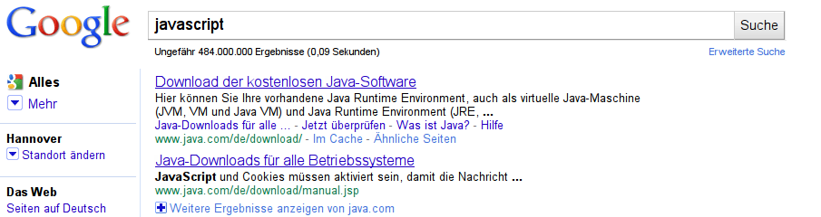

!SLIDE bullets smaller
# JavaScript is
* ECMAScript +
* manufacturer extensions + 
* countless libraries

!SLIDE bullets smaller
# JavaScript is
* the most popular interpreted language
* used for server processing, too (e.g. [CouchDB](http://couchdb.apache.org/))

!SLIDE bullets smaller
# JavaScript is
* [MobileMe](http://me.com)
* [280Slides](http://280slides.com/)

!SLIDE bullets smaller
# JavaScript is
* a dynamically typed,
* object oriented,
* functionally flavoured,
* class less and
* interpreted programming language

!SLIDE bullets smaller
# JavaScript is
* [getting faster](http://arewefastyet.com/)

!SLIDE bullets smaller
# JavaScript has
* 15 year old roots
* been created by [Brendan Eich](http://www.heise.de/developer/artikel/Gespraech-mit-Mozillas-Chefentwickler-Brendan-Eich-1128709.html)

!SLIDE bullets smaller
# JavaScript has
* nothing to do with Java!!!

!SLIDE bullets smaller
# [Versions](http://en.wikipedia.org/wiki/JavaScript#Versions)
* ECMAScript 3 (1999) is widely used
* [ECMAScript 5](http://davidflanagan.com/Talks/es5/slides.html) (2009) will be implemented by IE9, FF4, ...

!SLIDE bullets smaller
# [JavaScript Object Notation (JSON)](http://www.json.org/)
* lightweight, text based text format
* less verbose than XML
* Schema validation possible

!SLIDE code smallest
	@@@ javascript
    var tasks = [
     		    {
     		    	"id"   : 1,
     		    	"Title": "Milch einkaufen",
     		    	"State": "NEW"
     		    },
     		    {
     		    	"id"   : 2,
     		    	"Title": "Auto waschen",
     		    	"State": "NEW"
     		    }
     		];

!SLIDE code smallest
	@@@ javascript
	// JSON to JS and back again
	
	equals( JSON.stringify( JSON.parse('{"attribute":"value"}')),
	
			'{"attribute":"value"}');

!SLIDE
# Code tutorial

!SLIDE code larger
# Variables
	@@@ javascript
	
	// local
	var car = "BMW";
	
	// global
	plane = "Airbus";

!SLIDE code larger
# Primitive data types
	@@@ javascript
	undefined;
	
	null;
	
	Number(5.65) == 5.65;
	
	new String("Hello") == "Hello";
	
	Boolean(true) == true;
	
!SLIDE code smallest
# Pre-defined objects (arrays)
	@@@ javascript
	var array = [];
	array.push("entry");
	"entry" === array[0]
	
	// arrays as maps
	var cats = [{"color":"brown", "size":"large"},
        {"color":"black", "size":"small"}];
		assert "large" == cats[0]["size"];
 
 	// multidimensional arrays
	dogs = {"rover":{"color":"brown", "size":"large"},
        "spot":{"color":"black", "size":"small"}};

!SLIDE code smallest
# Pre-defined objects (object, date, math and regex)
	@@@ javascript
	// object
	new Object()
	
	//date
	assert new Date(2010,4,5).getTime() === 1273010400000
	
	//math
	Math.PI === 3.141592653589793
 	
 	// regualar expressions
 	/expression/.test(string);
	"string".search(/expression/);
	"string".replace(/expression/,replacement);
	
!SLIDE code smallest
# Error handling
	@@@ javascript
		

!SLIDE code smaller
# typeof operator
	@@@ javascript
	assert typeof new Object() === "object" === typeof {};
	assert typeof 5 === "number";
	assert typeof true === "boolean";
	assert typeof new Function() === "function";
	assert typeof undefined === "undefined";

	// special cases
	assert typeof null === "object";
	assert typeof [] === "object";
	assert typeof typeof null "string";

!SLIDE code larger
# instanceof operator
	@@@ javascript

	// use instanceof for arrays

	assert [] instanceof Array;

!SLIDE code larger
# null and undefined
	@@@ javascript
	
	var a = null;
	assert a === null;
	
	var b;
	assert b === undefined;
	

!SLIDE bullets smaller
# Control Structures
* if
* switch
* ternary operator
* loops
	
!SLIDE code	smaller
# Conditionals
	@@@ javascript 
	if (a > b) {
	    result = x;
	}
	else {
	    result = y;
	}
	
	// equals to
	
	result = a > b ? x : y;
	
!SLIDE code	smallest
# loops
	@@@ javascript 
	for (initial;condition;loop statement) { 
	}
	
	for (var property_name in some_object) {
 	}
 	
 	while (condition) {
    }
    
    do {
	} while (condition);
	
	// set the context with "with"
	var a = document.getElementById('a')
	with(document) {
   		var b = getElementById('a');
	 	assert a == b;
 	};

!SLIDE bullets smaller
# Equals and identity
* `==` checks for equality
* `===` checks for equality and type

!SLIDE code	smaller
# Equals and automatic type coercion
	@@@ javascript 
	// equals
	assert "5" == "5";
	
	// same
	assert "5" === "5";
	
	// equals
	assert "5" == 5;
	
	// not same
	assert "5" === 5;
	
!SLIDE code	smaller
# Special cases
	@@@ javascript 
	// equals
	assert true == 1;
	assert true == "0";
	
	// not equal
	assert false == "";
	
	var b = new Boolean(false);
	assert false == b;
	assert true == Boolean(b);
	assert false == new Boolean(b.valueof());
	

!SLIDE code larger	
# null and undefined
	@@@ javascript
	// equals
	assert null == undefined;
	
	// but not same!
	assert null !== undefined;
	
!SLIDE code larger
# Functions
	@@@ javascript
	
	function accelerate() {
		speed = speed + 1;
	}
	
!SLIDE code smallest
# Functions
	@@@ javascript
	// Function object
	var add = new Function('x','y','return x+y');
	assert 4 == add(1,2);
	
	// function assignment
	var mul = function(x,y) {return x*y;}
	assert 4 == mul(2,2);
	
	// function block
	function sub(x,y) {
		return x-y;
	}
	
	// anonymous function (closure)
	assert 4 == (function(x,y) {return x*y;})(2,2)
	
!SLIDE code smallest
# Functions
	@@@ javascript
	// nested Functions
	function parent() { 
		function child() {} 
	}
	
	// functions as parameters ...
	function execute(f) {
		f();
	}
	execute(function() {});
	
	// ... and return values
	var mul = function(x,y) {return x*y;}
	
	function getMul() {
		return mul;
	}
	
	assert 6 == getMul()(2,3);
	
!SLIDE code smaller
# Function arguments
	@@@ javascript
	function add(x,y) { return x+y; }
	
	// possible invocations
	add(1);
	add(1,2,3);
	
	// every function might access the argument array
	function getFirst() {
		return arguments[0];
	}
	assert 1 == getFirst(1,2,3);
	
!SLIDE code	smaller
# Return Values
	@@@ javascript 
	assert (function() {})() == undefined;
	
	assert (function() {"test"})() == undefined;
	
	assert (function() {return "test"})() == "test";

!SLIDE bullets smaller
# Check code quality
* Static code analysis: <http://www.jslint.com/>
* Testing: jqunit / canoo web test / selenium

!SLIDE bullets larger
# OO without Classes?
# >Prototyping<

!SLIDE bullets smaller
# [HTML5 rocks](http://googlewebtoolkit.blogspot.com/2010/04/look-ma-no-plugin.html)
* [WebSockets](http://dev.w3.org/html5/websockets/)
* [Web Storage]
* [Web SQL Database](http://dev.w3.org/html5/webdatabase/)

!SLIDE
# Tasks

!SLIDE bullets smaller
# #3
* JavaScript kick-start:
* Include jquery library
* create a message box

!SLIDE bullets smaller
# #4
* save the business data as json
* use jquery to fill the tables and details view

!SLIDE bullets smaller
# #5
* add editing features
* add the possibility to add new tasks

!SLIDE bullets smaller
# #6
* Connect to the REST backend

!SLIDE bullets smaller
# #7
* Push-Enable the application

!SLIDE bullets smaller
# #8
* Go offline! [1](http://www.ibm.com/developerworks/web/library/wa-offlineweb/index.html), [2](http://www.whatwg.org/specs/web-apps/current-work/multipage/offline.html)

!SLIDE bullets smaller
#How to move on?
* multiple selection -> updates, deletes
* offline mode (HTML5)
* push of data, e.g. concurrent modification (HTML5 comet)
* let the user add tabs (jquery-ui) plugin
* provide a date selector (jquery-ui) 

TODO:
--Portal Folien
--Sproutcore Samples und Folien
